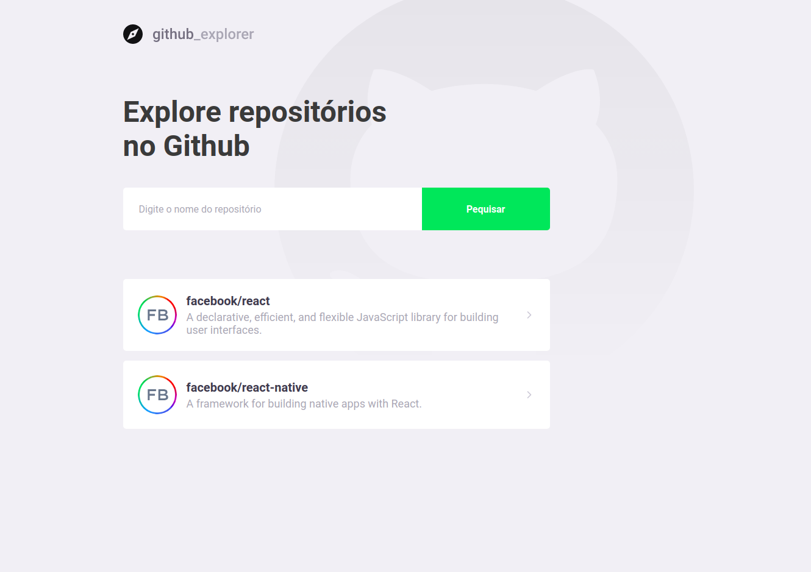

# Github Explorer

## Sobre 

Projeto para fins de aprendizado.
Utilizando ReactJS com Typescript, Styled Components.
Consume a API do Github com Axios e armazena as informações no local storage.

### `yarn start`
